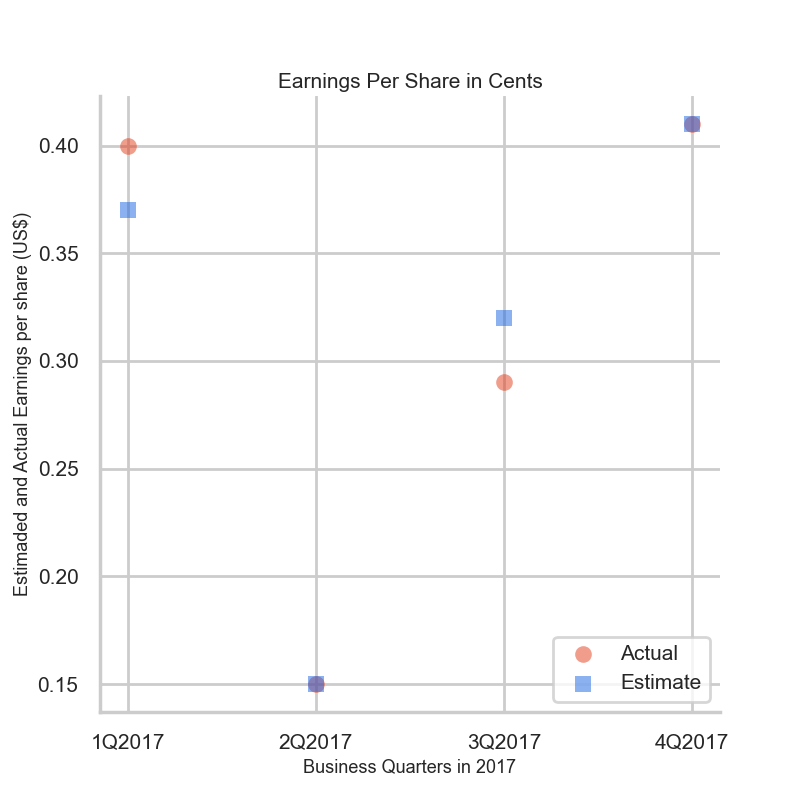
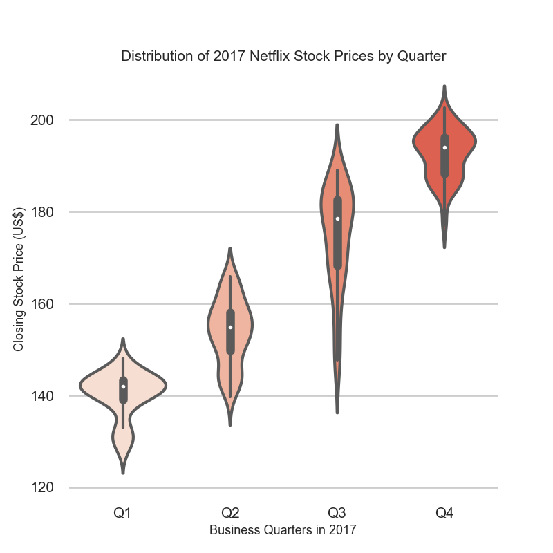
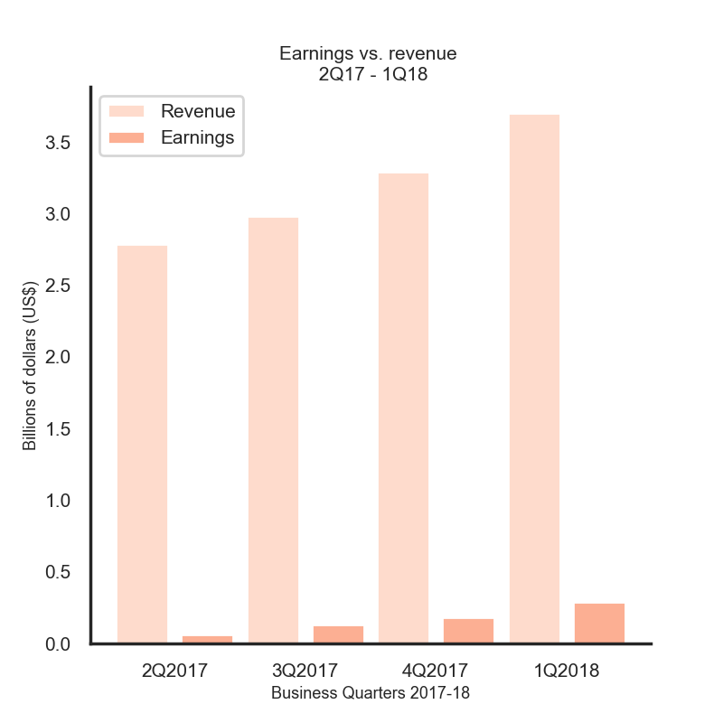
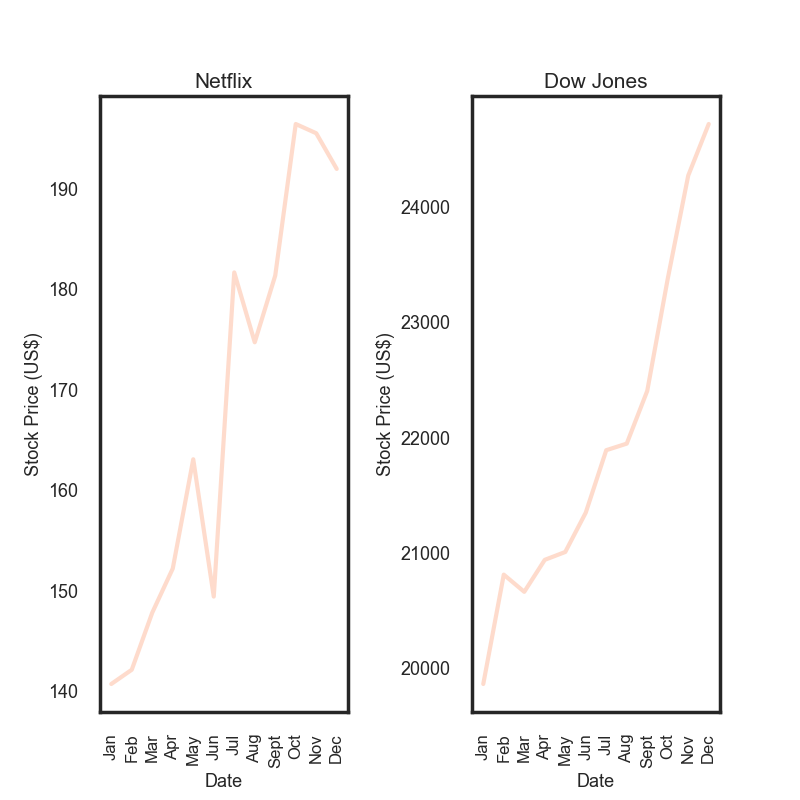
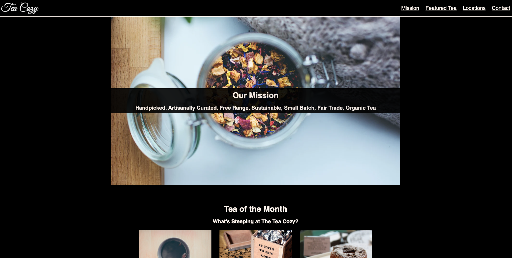

# Codecademy Projects 💻

> Please be noted that the following projects are just a sampling from the overall projects provided for practice by Codecademy.

### 1. Become a pokemon master

#### Description

I found this project slightly different than others I have encountered on Codecademy. It was not a step-by-step tutorial, instead, it indicated a series of open-ended requirements for the project to be built.

#### Project goals

Use **Python Classes** to create a game system _similar_ to the popular game series Pokémon where creatures battle against each other.

Every Pokémon has statistics associated with it like health, level, type, and a name.

### 2. Games of chance

#### Description

I wanted to include this project since it was my first project without step-by-step instructions. For which I needed to use other resources every time I encounter a problem not covered during the Codecademy course.

#### Project goals

Write several **Python Functions** that simulate games of chance.

Each one of these functions will use a number of parameters, random number generation, conditionals, and return statements.

### 3. Netflix stocks capstone

#### Description

This project was meant to combine everything I have learned about data visualization through the data analysis from the publicly traded company, Netflix, to visualize the performance of the stock during 2017.

#### Project goals

Combine Python data analysis and visualization tools: **Matplotlib**, **Pandas**, and **Seaborn**.

### 4. Veneer art marketplace

#### Description

Unlike the previous ones, this one was a step-by-step tutorial where I was allowed to build classes matching the business logic for a specialized marketplace for art traders by creating classes for each party:
- the art,
- the marketplace,
- the client (from a buy-side and sell-side perspective).

#### Project goals

Develop **Python Classes** and **Objects** that represent the various responsibilities of art dealership software.

### 5. Tea Cozy

#### Description

Based on a [design spec](https://content.codecademy.com/courses/freelance-1/unit-4/img-tea-cozy-redline.jpg) and image assets provided by Codecademy, I created the following fictional tea shop website: 

#### Project goals

Reproduce the basic **HTML** and **CSS** applying a layout with Flexbox.

